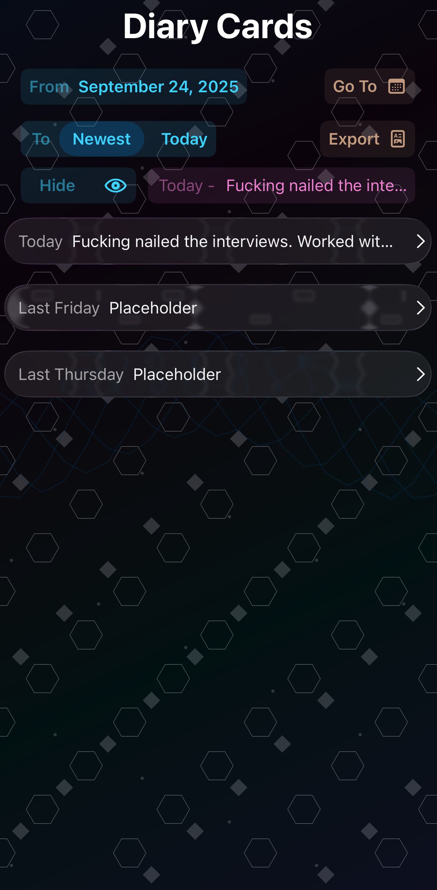

# Mood Journal Application

This is a mood journal application, customised for Dialectical Behaviour Therapy (DBT). 
It creates an entry everyday that can be filled in at any time. 
Each entry captures metrics for emotions configured in the app. (This will be customizable soon) 
It also has a Skill section where you can select skills you used during the day.
The export button creates a PDF with data from the chosen range of dates, which is the previous 7 days by default.

For those interested in origin story, [it's here](story.md)

Including a few screenshots to make this readme look nice.

### Cards list 
 &nbsp;

### Single card view
 &nbsp;

### Pretty overlay list I made
 &nbsp;

### Export
 &nbsp;

This looks the same in both modes.
